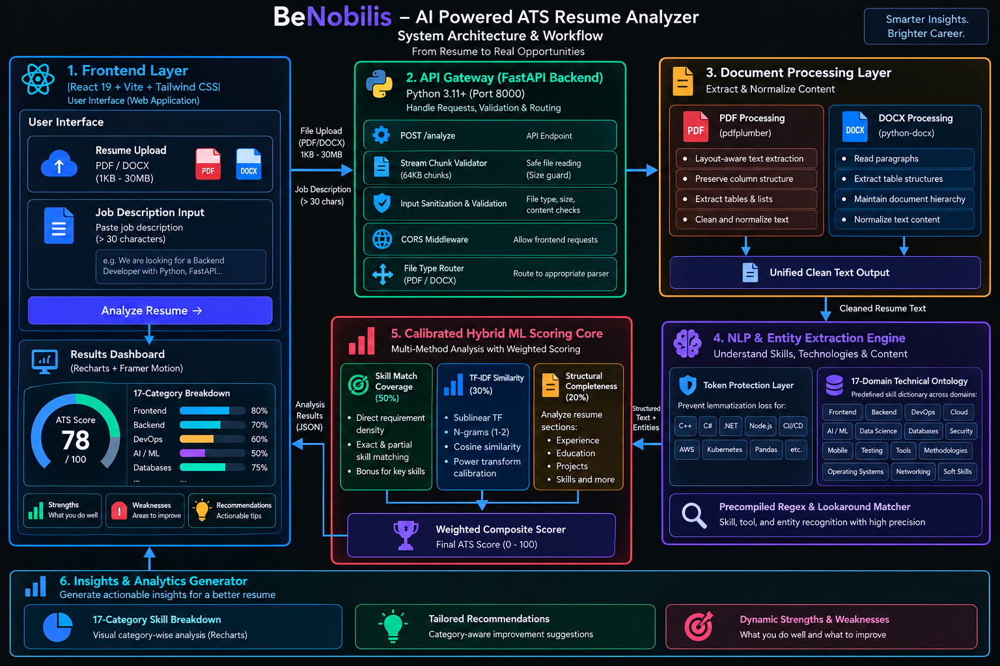
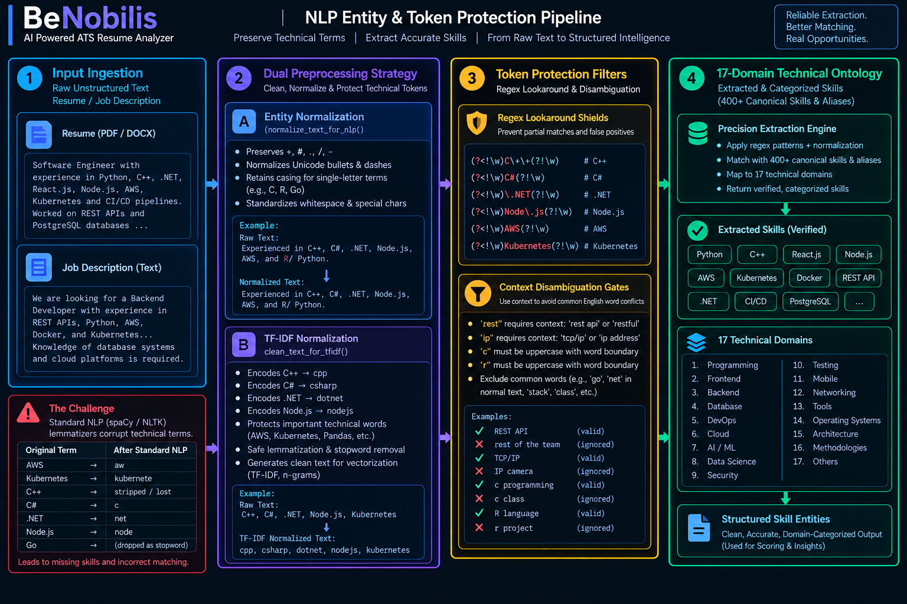
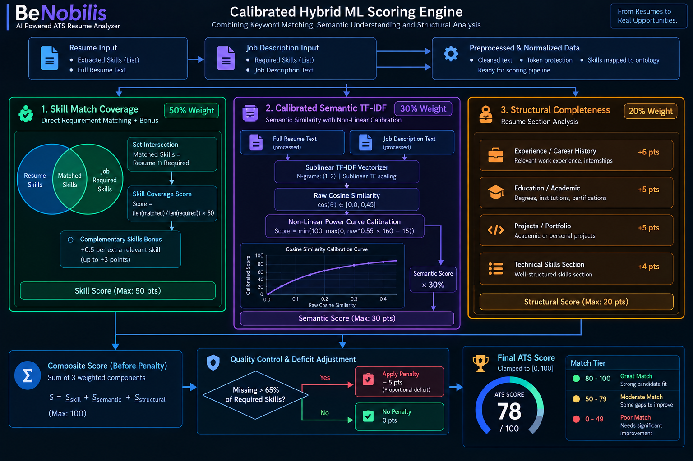

# BeNobilis — ATS Resume & Job Description Analyzer

BeNobilis is an open-source Applicant Tracking System (ATS) resume analyzer designed to evaluate candidate resumes against targeted job descriptions. Instead of relying on non-deterministic, high-latency large language model (LLM) calls, BeNobilis uses deterministic NLP entity extraction, symbol-preserving tokenization, and a calibrated TF-IDF machine learning model to deliver transparent, instant ATS feedback.

The system parses both PDF and DOCX files, identifies technical skills across 17 engineering domains, computes semantic alignment, and generates actionable recommendations to help candidates optimize their resumes.

---

## System Architecture

The following diagram illustrates the complete request lifecycle, from document ingestion on the client to parsing, NLP entity extraction, scoring, and dashboard visualization.



### Architecture Highlights

* **Client Layer**: Built with React 19, Vite, and Tailwind CSS. State management and animations are powered by Framer Motion, with interactive metrics rendered via Recharts.
* **API Gateway**: An asynchronous FastAPI backend with configurable CORS support, stream-chunk memory guards (supporting files from 1 KB up to 30 MB), and strict input validation.
* **Document Parsing**: A dual-format parsing pipeline that extracts selectable text from multi-column PDFs (`pdfplumber`) and reads structured paragraphs and tables from Word documents (`python-docx`).
* **Intelligence Layer**: Combines precompiled regex lookaround guards, a master 17-domain ontology, and sublinear TF-IDF vectorization to produce calibrated match metrics.

---

## NLP Entity & Token Protection Pipeline

Standard general-purpose NLP tokenizers and English lemmatizers often damage technical vocabulary. For example, default English lemmatizers mistakenly strip the "s" from proper tech nouns (converting "AWS" to "aw" and "Kubernetes" to "kubernete"), drop single-letter programming languages like "C" and "R", and discard tools like "Go" or "Next.js" as standard English stopwords.

BeNobilis addresses this with a dual-track preprocessing and entity protection pipeline:



### Key Pipeline Components

* **Dual-Track Normalization**:
  * *Entity Normalization*: Preserves technical punctuation (`+`, `#`, `.`, `/`, `-`) and casing for single-letter languages like `C` and `R`.
  * *TF-IDF Vectorization Cleaning*: Safely maps compound symbols (`C++` to `cpp`, `C#` to `csharp`, `.NET` to `dotnet`, `Node.js` to `nodejs`, `CI/CD` to `cicd`) while protecting technical lemmas like `pandas`, `transformers`, and `microservices`.
* **Regex Lookaround Guards**: Employs boundary patterns such as `(?<!\w)C\+\+(?!\w)` to ensure special-character technologies are detected accurately regardless of surrounding punctuation.
* **Context Disambiguation**: Contextual filters prevent common English words from causing false positives. For example, "REST API" requires explicit API context rather than matching phrases like "the rest of the team", and "TCP/IP" is disambiguated from generic references to "IP".
* **17-Domain Technical Ontology**: Extracted skills are classified across 17 distinct engineering categories, including Frontend, Backend, Databases, DevOps, Cloud, AI/ML, Data Science, Security, Testing, Mobile, and Networking.

---

## Calibrated Hybrid ML Scoring Engine

In document retrieval, comparing an asymmetric text pair—such as a 600-word resume against a 60-word job description—naturally suppresses raw cosine similarity due to vector length disparity. Linear scaling often results in even well-matched candidates receiving artificially low scores.

BeNobilis implements a three-pillar hybrid scoring model with calibrated non-linear power curve scaling:



### Scoring Pillars

1. **Skill Match Coverage (50% Weight)**:
   Measures direct technical overlap between candidate skills and job description requirements. A complementary bonus (up to +3 points) is awarded for relevant extra skills within the same engineering domain.
2. **Calibrated Semantic TF-IDF (30% Weight)**:
   Extracts unigram and bigram features with sublinear term-frequency weighting (`sublinear_tf=True`). The raw cosine similarity is calibrated using a power-curve transformation ($S = \text{raw}^{0.55} \times 160 - 15$), correctly mapping genuine semantic alignment onto an objective 0–100 scale.
3. **Structural Section Completeness (20% Weight)**:
   Detects core resume sections (Experience, Education, Projects, and Skills) using regex matching that accommodates industry synonyms such as "Work History", "Academic Background", and "Technical Proficiencies".
4. **Proportional Deficit Adjustment**:
   If a job description specifies three or more requirements and the resume covers less than 35% of them, a proportional penalty is applied to prevent inflated scores on underqualified submissions.

---

## Features Overview

* **Objective ATS Match Scoring**: Delivers a calibrated 0–100 score categorized into clear match tiers: Great Match (80–100), Moderate Match (50–79), and Poor Match (0–49).
* **Multi-Format Document Ingestion**: Supports both PDF and DOCX formats with layout awareness, table extraction, and detection of non-selectable or scanned image files.
* **17-Domain Category Breakdown**: Displays matched, missing, and extra skills organized by domain, giving candidates immediate insight into specific technical gaps.
* **Tailored Optimization Recommendations**: Generates contextual advice across all 17 technical categories, highlighting missing competencies and suggesting structural improvements.
* **Dynamic Strengths and Weaknesses**: Produces candidate-specific strengths and improvement areas derived directly from verified skills and role requirements.
* **Crash-Resilient Architecture**: Client-side error handling prevents white-screen crashes on failed validations, while server-side streaming prevents memory exhaustion.

---

## Tech Stack

### Frontend
* **Core**: React 19, JavaScript (ES6+)
* **Build Tool**: Vite
* **Styling**: Tailwind CSS
* **Visualizations**: Recharts (Pie Chart and Category Progress Breakdown)
* **Icons & Animation**: Lucide React, Framer Motion

### Backend
* **Framework**: FastAPI (Python 3.10+)
* **Server**: Uvicorn
* **Document Parsing**: `pdfplumber`, `python-docx`
* **NLP & Tokenization**: `spaCy` (`en_core_web_sm`), custom regex engine
* **Machine Learning**: `scikit-learn` (TF-IDF Vectorizer, Cosine Similarity), `numpy`

---

## Project Structure

```
BeNobilis/
├── backend/
│   ├── app/
│   │   ├── main.py              # FastAPI application entrypoint & CORS config
│   │   ├── models/
│   │   │   └── schemas.py       # Pydantic data schemas for API responses
│   │   ├── routes/
│   │   │   └── analyze.py       # Core /analyze POST endpoint with stream validation
│   │   ├── services/
│   │   │   ├── parser.py        # PDF & DOCX document text extraction
│   │   │   ├── nlp_engine.py    # Symbol-safe entity & skill extraction engine
│   │   │   ├── ml_scorer.py     # Sublinear TF-IDF & calibrated cosine similarity
│   │   │   ├── scorer.py        # Hybrid ATS score & 17-category classification
│   │   │   └── recommender.py   # Domain-tailored recommendations generator
│   │   └── utils/
│   │       ├── skill_db.py      # Master 17-domain ontology & alias dictionary
│   │       └── text_cleaner.py  # Dual-track text normalization & token shields
│   └── requirements.txt         # Backend Python dependencies
├── docs/
│   ├── system_architecture.png  # End-to-end request lifecycle diagram
│   ├── nlp_pipeline.png         # Token protection & entity extraction diagram
│   └── ml_scoring_engine.png    # Hybrid ML ATS scoring engine diagram
├── frontend/
│   ├── src/
│   │   ├── components/
│   │   │   └── Navbar.jsx       # Application header and navigation
│   │   ├── pages/
│   │   │   ├── Home.jsx         # Landing page and feature introduction
│   │   │   ├── Upload.jsx       # File upload interface with drag-and-drop
│   │   │   └── Dashboard.jsx    # Results dashboard & category breakdown
│   │   ├── App.jsx              # Main React application component
│   │   ├── main.jsx             # React DOM entrypoint
│   │   └── index.css            # Tailwind CSS directives and global styles
│   ├── package.json             # Frontend Node.js dependencies
│   └── vite.config.js           # Vite configuration
└── README.md                    # Project documentation
```

---

## Local Setup & Installation

### Prerequisites
* Python 3.10 or higher
* Node.js 18 or higher with npm

### 1. Backend Setup

```bash
cd backend
python -m venv venv

# Activate virtual environment
# Windows:
venv\Scripts\activate
# macOS/Linux:
source venv/bin/activate

# Install dependencies and download language model
pip install -r requirements.txt
python -m spacy download en_core_web_sm

# Start the API server
uvicorn app.main:app --reload
```

The backend server will start at `http://localhost:8000`. You can explore the interactive API documentation at `http://localhost:8000/docs`.

### 2. Frontend Setup

In a new terminal window:

```bash
cd frontend
npm install

# Start the development server
npm run dev
```

The frontend application will be available at `http://localhost:5173`.

---

## Future Improvements

* **OCR Integration**: Add optical character recognition (`pytesseract` or AWS Textract) to extract text from scanned and image-only PDF resumes.
* **Resume Version History**: Allow users to save past analysis results and track resume iterations over time.
* **Exportable PDF Reports**: Enable one-click downloading of comprehensive ATS diagnostic reports.
* **Custom Keyword Targeting**: Allow hiring managers or candidates to designate required versus optional skill weights.

---

## Author

**Mayank Singh**  
GitHub: [@mayanksingh05](https://github.com/mayanksingh05)
